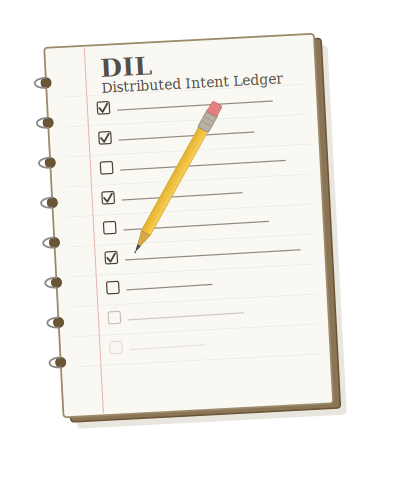

<p align="center">
  
</p>

# DIL: Your All-Terrain Memory System.<br>For everywhere you cli.

Want to share memories across all your agents? Claude + [OpenCode](https://grokipedia.com/page/OpenCode) + Codex + Gemini + [OpenClaw](https://grokipedia.com/page/Clawdbot)? Just add DIL.

DIL is a simple, working plan for unified memory across all your agents.

```bash
# Minimal DIL Onboarding:
mkdir -p dil_agentic_memory && cd dil_agentic_memory ;
git clone https://github.com/zigmoo/distributed_intent_ledger.git ;
ln -s $HOME/dil_agentic_memory/distributed_intent_ledger/READ_THIS_DIL_FIRST.md $HOME/dil.md ;

# Bootstrap your agent (pick one or more):
# echo '## DIL Session Bootstrap\nRead $HOME/dil.md first.' >> $HOME/.claude/CLAUDE.md
# echo '## DIL Session Bootstrap\nRead $HOME/dil.md first.' >> $HOME/.config/opencode/AGENTS.md
# echo '## DIL Session Bootstrap\nRead $HOME/dil.md first.' >> $HOME/.codex/instructions.md
# echo '## DIL Session Bootstrap\nRead $HOME/dil.md first.' >> $HOME/.openclaw/workspace_01/AGENTS.md
# echo '## DIL Session Bootstrap\nRead $HOME/dil.md first.' >> $HOME/.pi/AGENTS.md
# echo '## DIL Session Bootstrap\nRead $HOME/dil.md first.' >> $HOME/.zeroclaw/AGENTS.md
```

Distributed Intent Ledger (DIL) is a local-first, filesystem-native protocol for persistent multi-agent and multi-environment memory coordination.
In current deployments, [Tailscale](https://github.com/tailscale/tailscale) is used as an optional private network fabric for secure cross-machine agent communication and coordination.
Relies on Obsidian vault sync.

For a compact human-readable summary of the whole system, start with [`docs/dil-overview.md`](./docs/dil-overview.md).

## What Sets DIL Apart

What sets DIL apart from other approaches is that it unifies memories and tasks across disparate environments for any assortment of AI Agents and AI Assistants by defining memory as a governed protocol, not just a storage format.

- Deterministic identity and scope boundaries:
  - Runtime-derived `machine` and `assistant` identities.
  - Scope-first writes to `<machine>/<assistant>` with explicit promotion to `_shared`.
  - Multi-agent collaboration is safe-by-default and auditable.
- Filesystem-native and human-auditable:
  - Plain files, frontmatter, and indexes (Obsidian-friendly).
  - No opaque memory database lock-in.
  - Start with plain Markdown for maximum transparency; switch to SQLite anytime for runtime/cache needs.
  - Humans can inspect, repair, and diff records directly.
- Protocolized read/write behavior:
  - Required frontmatter schema.
  - Mandatory retrieval order (`local -> machine -> shared`).
  - Mandatory index and change-log maintenance.
- Anti-parrot execution proof:
  - Write operations must return concrete file paths and excerpts.
  - Prevents false claims that persistence happened when it did not.
- Cross-agent task canon:
  - Shared canonical registry, lifecycle transitions, allocator, and validation.
  - Decouples task identity from any single runtime/model.
  - Enables reliable handoffs across machines and assistants.
- Mixed-model operational resilience:
  - Script-first, idempotent workflows.
  - Validation gates before side effects.
  - Fail-closed behavior suitable for weaker/local models as well as frontier models.

## Scope

DIL defines:
- deterministic runtime identity resolution (`machine`, `assistant`)
- scoped write boundaries and promotion rules
- retrieval order across local/machine/shared scopes
- frontmatter and task metadata contracts
- machine and agent registries for routing/capability discovery
- index and change-log maintenance requirements
- validation gates for task mutations

## How to Use DIL

### Scenario 1: Shared Memory Across All Agents on One Machine

1. Choose a local vault path on that machine.
2. Clone this repository into the vault:
   - `git clone https://github.com/zigmoo/distributed_intent_ledger.git`
3. In each agent/assistant session, start with:
   - `Read ~/READ_THIS_DIL_FIRST.md now and acknowledge.`
4. Resolve runtime identity before read/write:
   - `machine`: `hostname -s | tr '[:upper:]' '[:lower:]'`
   - `assistant`: env/process-derived slug (no guessing from folder names)

### Scenario 2: Shared Memory Across All Agents on Multiple Machines

1. Create an Obsidian vault and configure remote syncing.
2. Set up Tailscale on each machine and join them to your tailnet.
3. Clone this repository into that synced vault:
   - `git clone https://github.com/zigmoo/distributed_intent_ledger.git`
4. In each agent/assistant session, start with:
   - `Read ~/READ_THIS_DIL_FIRST.md now and acknowledge.`

### Common Operating Steps (Both Scenarios)

1. Create memory notes via script (preferred):
   - `scripts/create_memory.sh --type observations --title "..." --base <vault>`
2. Create canonical tasks via script:
   - Personal: `scripts/create_task.sh --domain personal --title "..." --project "..." --base <vault>`
   - Work: `scripts/create_task.sh --domain work --task-id DMDI-12345 --title "..." --project "..." --base <vault>`
3. Enforce retrieval order when answering:
   - local assistant scope -> machine scope -> shared policies -> shared global
4. Validate tasks before claiming completion:
   - `scripts/validate_tasks.sh <vault>`
5. Return proof after writes (anti-parrot rule):
   - changed file paths
   - placement proof (`find`/tree output)
   - short excerpts from changed files
6. Maintain shared runtime inventories:
   - `_shared/_meta/machine_registry.json`
   - `_shared/_meta/agent_registry.json`
   - ensure each agent declares supported formats, runtime profiles, and fallback-LLM behavior

Minimum operating rule: write to `<machine>/<assistant>` first, promote to `_shared` only for cross-machine/cross-assistant facts.

## Optional Starter Artifacts

The generic repo can also carry reusable policy and project-template artifacts that deployments may copy into their live vaults:

- `docs/recommended-agent-workflow-discipline.md`
  - optional shared policy guidance for planning, verification, self-correction, and security hygiene
- `examples/project-claude-md.md`
  - starter project-level agent guidance file that can be adapted into `CLAUDE.md`

## License

This project is licensed under the Apache License 2.0. See `LICENSE` and `NOTICE`.

## Repository Layout

- `READ_THIS_DIL_FIRST.md`: bootstrap spec — every agent reads this first, every session
- `_shared/`: operational shared state (domains, meta, tasks)
  - `_shared/_meta/`: bootstrap config files
    - `domain_registry.json`: registered domains with ID prefixes, paths, and archive policies
    - `project_registry.md`: canonical project slugs with aliases for task discovery
    - `command_registry.md`: zero-inference command lookup table
    - `agent_aliases.conf`: agent identity alias mappings
    - `task_id_counter.md`: auto-allocated task ID counters per prefix
    - `task_index.md`: scan-first task index
  - `_shared/domains/`: domain-scoped task directories
    - `personal/tasks/{active,archived}/`: personal-domain tasks (DIL- prefix)
    - `work/tasks/{active,archived}/`: work-domain tasks (external IDs)
- `docs/`: protocol documentation
  - `spec-v1.md`: normative protocol contract (MUST/SHOULD/MAY)
  - `dil-overview.md`: concise human-readable overview of the full DIL system
  - `recommended-agent-workflow-discipline.md`: optional shared workflow-discipline policy
  - `machine-registry-contract.md`: machine inventory and runtime host contract
  - `agent-registry-contract.md`: agent capabilities, formats, models, and fallback contract
- `runbooks/`: procedural runbooks
  - `task-lifecycle-runbook.md`: create-to-done task lifecycle steps
- `schema/`: JSON schemas for notes and tasks
- `examples/`: sample records and starter config templates
  - `sample-domain-registry.json`: multi-domain registry with generalized paths
  - `sample-project-registry.md`: project slugs with aliases and column reference
  - `sample-command-registry.md`: command trigger lookup table
  - `sample-agent-aliases.conf`: agent identity alias mappings
  - `sample-agent-registry.json`: multi-agent runtime/capability coverage
  - `sample-machine-registry.json`: multi-machine lifecycle coverage
  - `sample-task.md`: expanded canonical task example with acceptance criteria
  - `sample-memory-note.md`: decision-style memory note example
  - `sample-change-log.md`: multi-entry mutation/change-log example
- `scripts/`: reference helpers and validators
  - `create_task.sh`: canonical task creation with ID allocation and index update
  - `create_project.sh`: project registry management
  - `create_jira_task.sh`: Jira + DIL mirrored task creation
  - `create_engineering_notebook_entry.sh`: structured engineering notes
  - `morning_brief.sh`: daily task briefing generator
  - `identify_agent.sh`: runtime agent identity resolution
  - `validate_tasks.sh` / `validate_tasks.py`: task system validation
  - `archive_tasks.sh`: move terminal tasks to archived/
  - `list_archived.sh`: search/filter archived tasks
  - `rebuild_task_index.sh`: regenerate task index from files
  - `lib/domains.sh`: domain registry lookup helpers
  - `lib/registry.sh`: project registry lookup helpers
